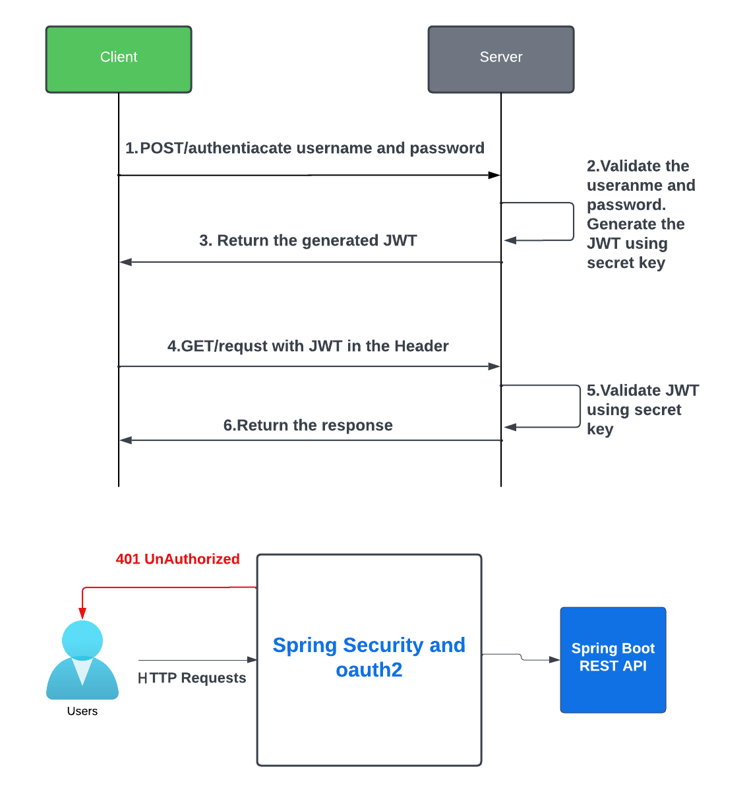
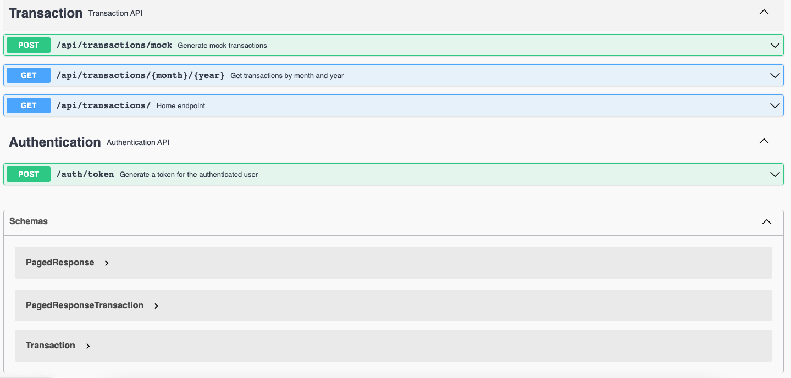

This e-Banking Portal provides a reusable ***REST API*** for returning the paginated list of money account transactions created in an arbitrary calendar month for a given customer who is logged-on in the portal. For each transaction 'page', it returns the total credit and debit values at the current exchange rate (from a third-party provider). The list of transactions is consumed from a Kafka topic. This project includes a Docker image of the application and the configuration for deploying it to Kubernetes / OpenShift.

# Features

- Paginated list of transactions for a specific customer and calendar month
- Total credit and debit values at the current exchange rate
- Consumption of transaction data from a Kafka topic
- JWT authentication and Java Security
- Docker containerization
- Kubernetes/OpenShift deployment configuration

#  Assumptions

-   Every e-banking client has one or more accounts in different currencies (e.g. GBP, EUR, CHF)
-   There are approximately one hundred thousand e-banking customers, each with a couple thousands of transactions per month.
-   The transactions cover the last ten years and are stored in Kafka with the key being the transaction ID and the value the JSON representation of the transaction
-   The user is already authenticated and the API client invoking the transaction API will send a JWT token containing the user’s unique identity key (e.g. P-0123456789)
-   The exchange rate on any given date is provided by an external API

For simplicity reasons, consider a money account transaction composed of the following attributes:
-   Unique identifier (e.g. 89d3o179-abcd-465b-o9ee-e2d5f6ofEld46)
-   Amount with currency (eg GBP 100-, CHF 75)
-   Account IBAN (eg. CH93-0000-0000-0000-0000-0)
-   Value date (e.g. 01-10-2020)
-   Description (e.g. Online payment CHF)


# Diagram
### Jwt + Java Scurity


### Component Diagram


# API
### Access the Swagger API documentation
Navigate to the Swagger API documentation page:

```bash
http://localhost:8080/swagger-ui/index.html#/
```



# Set Up
Docker-compose using [zk-single-kafka-single.yml](https://github.com/conduktor/kafka-stack-docker-compose/blob/master/zk-single-kafka-single.yml) 
```bash
docker-compose up
```
Docker Container
```bash
CONTAINER ID   IMAGE                             COMMAND                  CREATED      STATUS       PORTS                                                                      NAMES
33a759dc7229   confluentinc/cp-kafka:7.3.2       "/etc/confluent/dock…"   6 days ago   Up 3 hours   0.0.0.0:9092->9092/tcp, 0.0.0.0:9999->9999/tcp, 0.0.0.0:29092->29092/tcp   kafka1
8ab0691e89ae   confluentinc/cp-zookeeper:7.3.2   "/etc/confluent/dock…"   6 days ago   Up 3 hours   2888/tcp, 0.0.0.0:2181->2181/tcp, 3888/tcp                                 zoo1
```

# Test

#### 1. Authenticate and obtain a JWT token
Using postman:
```bash
POST http://localhost:8080/auth/token

Basic Auth
Username:eddie
Password:1234
```

Using httpie:
```bash
http POST :8080/token --auth eddue:1234 -v
```
#### 2. Test GET Request with Bearer Token

```bash
GET http://localhost:8080/api/transactions/

Bearer Token
Token: ENTER_JWT_TOKEN
```
#### 3. Mock data using Kafka producer.

```bash
POST http://localhost:8080/api/transactions/mock

Bearer Token
Token: ENTER_JWT_TOKEN
```

#### 4. Test GET Request to retrieve the transactions for March 2023

```bash
GET http://localhost:8080/api/transactions/03/2023

Bearer Token
Token: ENTER_JWT_TOKEN
```

User information:

| UserName      | Password      | Identity Key| Account Iban |
| ------------- |:-------------:| :--------:  | :--------:   |
| eddie         | 1234          | P-0123456789| CH93-0000-0000-0000-0000-0 |
| tyler         | 4321          | P-1111111111| CH93-0000-0000-0000-0000-1 |

Mock data format be like this:

```bash
"key": "P-0123456789",
"value": {
   "identityKey": "P-0123456789",
   "uniqueIdentifier": "89d3o179-blbc-465b-o9ee-e2d5f6ofEld46",
   "amount": "150",
   "currency": "CHF",
   "ibanAccount": "CH93-0000-0000-0000-0000-0",
   "valueDate": "01-03-2023",
   "description": "Online payment CHF"
        }

"key": "P-0123456789",
"value": {
   "identityKey": "P-0123456789",
   "uniqueIdentifier": "92d43cde-4s2o-5123-1521-523lsd018",
   "amount": "100",
   "currency": "USD",
   "ibanAccount": "CH93-0000-0000-0000-0000-0",
   "valueDate": "02-03-2023",
   "description": "Online payment USD"
        }
......

```